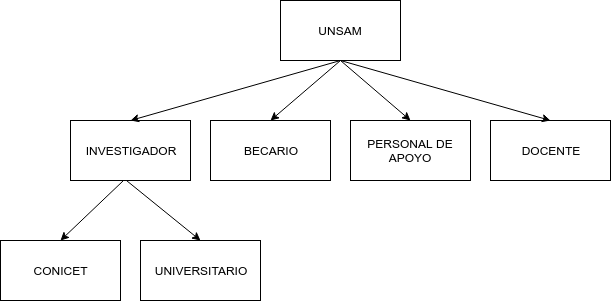
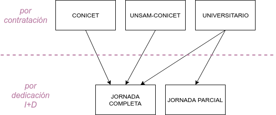
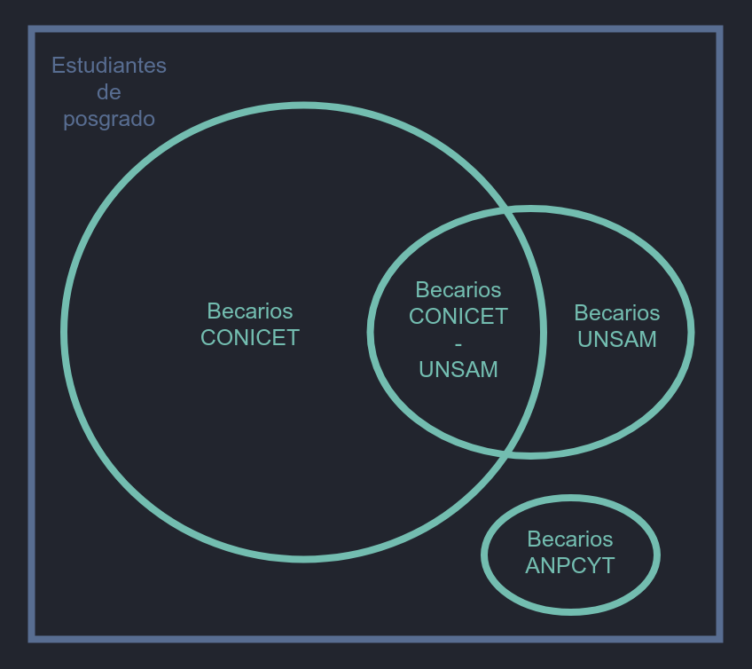

# Definiciones

## Investigadores

::: tip Clasificación
El personal es clasificado como **INVESTIGADOR** es contratado para desarrollar su actividad en el ámbito de la UNSAM y satisface los criterios de mérito.
:::

### Condición de investigador

#### _Debe contar con al menos un cargo que implique pertenencia a la UNSAM:_

- Cargo docente UNSAM: dedicación exclusiva, semiexclusiva, simple o contrato equivalente como investigador.
- Carrera el Conicet con lugar de trabajo en la UNSAM.
- Carrera CIC con lugar de trabajo en la UNSAM.

#### _Y cumplir con al menos una condición de mérito._

- Tener categoría I, II o III en el Programa de Incentivo Docente.
- Ser miembro de un proyecto I+D acreditado de la UNSAM.
- Publicar al menos 2 artículos con referato en el último quinquenio.
- Publicar al menos 1 libro con referato en el último quinquenio.
- Publicar al menos 1 capítulo de libro en el último quinquenio.
- Publicar al menos 1 trabajo en evento en el último quinquenio.
- Haber iniciado un trámite de registro de patente en el útlimo quinquenio.

### ACLARACIÓN para los docentes simples

- Para el caso de docentes con dedicación simple sólo se consideran investigadores si son miembros de un proyecto acreditado en la UNSAM.

### Clasificación de investigadores para indicadores

Los investigadores puede clasificarse de acuerdo a indicadores que respondan a diferentes fines. Sin embargo existen dos clasificaciones que por su utilidad se consideraran más significativas.

#### _por contratación_

- UNIVERSITARIO: Tiene dedicación docente exclusiva, semi-exclusiva, dos cargos simples o contrato equivalente como investigador en la misma unidad académica.
- CONICET: Carrera de investigador el CONICET con lugar de trabajo en la UNSAM, puede tener hasta una dedicación docente simple.
- UNSAM-CONICET: Carrera de investigador el CONICET con lugar de trabajo en la UNSAM, tienen dedicación docente exclusiva o semiexclusiva.
- ASOCIADO: Es reconocido como investigador por la unidad académica en condición ad-honorem.

#### _por dedicación a la I+D_

- JORNADA COMPLETA: dedica mas de 30 horas semanales a la actividad I+D.
- JORNADA PARCIAL (hasta 30hrs): dedica hasta 30 horas semanales a la actividad I+D.
- JORNADA PARCIAL (hasta 4hrs): dedica menos de 4 horas semanales a la actividad I+D.

 

## Becarios

::: tip Clasificación
Los becarios están clasificados según la entidad que financia su beca.
:::

<!--  -->

- BECARIOS UNSAM: perciben una beca de doctorado o posdoctorado financiada por la UNSAM o alguna de sus unidades académicas.
- BECARIOS CONICET: perciben una beca financiada por el CONICET con lugar de trabajo en la UNSAM.
- BECARIOS UNSAM-CONICET: perciben una beca cofinanciada por el CONICET y la UNSAM.
- BECARIOS ANPIDTI: son miembros de un proyecto otorgado a la UNSAM y financiado por la ANPIDTI. Deben ser estudiantes de posgrado de una carrera acreditada por la CONEAU y su director debe ser miembro del grupo responsable (no necesariamente con lugar de trabajo en la UNSAM).

## Personal de apoyo

- TÉCNICO: es la persona cuyo trabajo requiere conocimiento y experiencia de naturaleza técnica en uno o en varios campos del saber. Ejecutan sus tareas bajo la supervisión del investigador. En general corresponde a: asistentes de laboratorio, dibujantes, asistentes de ingenieros, fotógrafos, técnicos mecánicos y eléctricos, programadores, etc. Esta categoría incluye a estudiantes universitarios no graduados que realizan actividades de I+D.
- ADMINISTRATIVO: es la persona que colabora en servicios de apoyo a las actividades de investigación y desarrollo (I+D), tales como personal de oficina, administrativos, operarios, etc. Esta categoría incluye a gerentes y administradores que se ocupan de problemas financieros, de personal, etc., siempre que sus actividades se relacionen con CyT.
- CPA-CONICET: personal de apoyo el CONICET.

## Docentes

Los docentes no realizan actividades de ciencia y tencnología en el ámbito de la UNSAM y están clasificados por su cargo de dedicación máxima.

- DOCENTE EXCLUSIVO: docente de dedicación exclusiva.
- DOCENTE SEMI-EXCLUSIVO: docente de dedicacion semi-exclusiva.
- DOCENTE SIMPLE: docente de dedicación simple.
- CONTRATADO: docente que es contratado y no tiene asociada una dedicacion.
