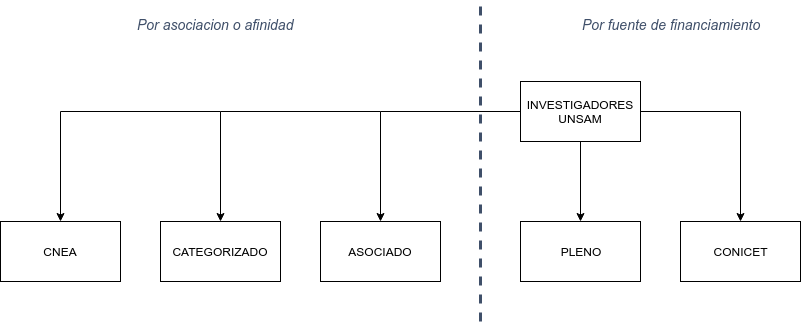
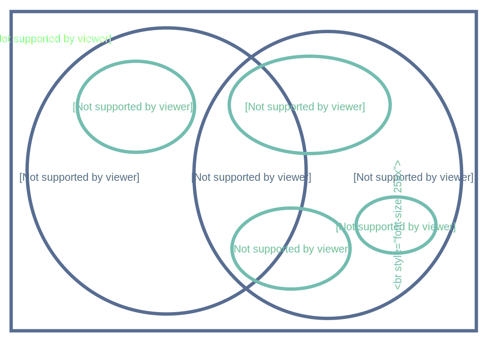

# Definiciones

## Investigadores

<!--  -->

### Clasificación

- UNSAM: Tiene dedicación docente exclusiva o semiexclusiva, dos dedicaciones simples dentro de la misma Unidad Académica o ser contratado como Investigador.
- CONICET: Carrera de investigador CONICET con lugar de trabajo en UNSAM, puede tener una dedicación simple.
- UNSAM-CONICET: Carrera de investigador CONICET con lugar de trabajo en UNSAM, tienen dedicación exclusiva o semiexclusiva.
- ASOCIADO: Es reconocido como investigador por la Unidad Académica y homologado mediante una carta firmada por el decano.

::: tip CONDICIONES
Una persona es considerada INVESTIGADOR si cumple por lo menos con una condición de contratación y una condición de mérito.
:::

<!--  -->

### Condiciones de contratación

- Cargo docente en UNSAM de dedicación exclusiva, semiexclusiva o dos dedicaciones simples dentro de la misma Unidad Académica.
- Cargo de investigador CONICET(CIC) con lugar de trabajo en UNSAM.
- Contrato como investigador en UNSAM equivalente a una dedicación exclusiva.

### Condiciones de mérito

- Categoría I, II o III en el programa de Incentivo Docente.
- Por lo menos 2 artículos con referato publicados en un quinquenio sin importar la afiliación.
- Por lo menos 1 libro con referato publicado en un quinquenio sin importar la afiliación.
- Solicitud de patentes en un quinquenio.

## Becarios

::: tip Clasificación
Los becarios están clasificados según la entidad que financia su beca.
:::

<!--  -->

- BECARIOS UNSAM: perciben una beca de doctorado o posdoctorado financiada por UNSAM o alguna de sus dependencias.
- BECARIOS CONICET: perciben una beca financiada por CONICET con lugar de trabajo en UNSAM.
- BECARIOS UNSAM-CONICET: perciben una beca cofinanciada por CONICET Y UNSAM.
- BECARIOS ANPCYT: son miembros de un proyecto otorgado a UNSAM y financiado por ANPCYT. Deben ser estudiantes de posgrado de una carrera acreditada por la CONEAU, su director debe ser miembro del grupo no necesariamente con lugar de trabajo en UNSAM.

## Personal de apoyo

- TÉCNICO: es la persona cuyo trabajo requiere conocimiento y experiencia de
naturaleza técnica en uno o en varios campos del saber. Ejecutan sus tareas bajo la
supervisión del investigador. En general corresponde a: asistentes de laboratorio, dibujantes,
asistentes de ingenieros, fotógrafos, técnicos mecánicos y eléctricos, programadores, etc.
Esta categoría incluye a estudiantes universitarios no graduados que realizan actividades de
I+D.
- ADMINISTRATIVO: : es la persona que colabora en servicios de apoyo a las actividades de
investigación y desarrollo (I+D), tales como personal de oficina, administrativos, operarios,
etc. Esta categoría incluye a gerentes y administradores que se ocupan de problemas
financieros, de personal, etc., siempre que sus actividades se relacionen con CyT.
- CPA-CONICET: personal de apoyo CONICET.
