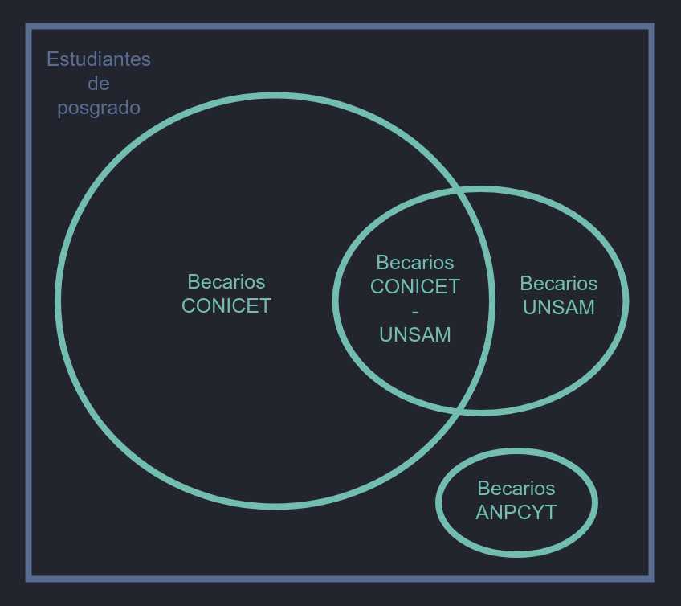

# Definiciones

## Investigadores

Los investigadores poseen una gran trayectoria en su campo de investigación, dirigen proyectos, forman recursos humanos, producen, divulgan y transfieren conocimento.
Para considerarlos tales deben cumplir con algunas de las condiciones necesarias dispuestas en dos grupos:

- PLENO: Dedicación Exclusiva o Semiexclusiva.
- CONICET: Carrera CONICET con lugar de trabajo en UNSAM, si tienen dedicacion exclusiva o semiexclusiva son UNSAM-CONICET.
- ASOCIADO: No tiene cargo docente en UNSAM que denote dedicación a la investigación.
- CATEGORIZADO: tiene categoria 1, 2 o 3 del Programa de Incentivos.
- SIMPLE: tiene dedicacion simple, es docente.
- CNEA: Cargo en CNEA.

### CONDICIONES PRIMARIAS

1. Poseen una dedicación exclusiva, semiexclusiva o dos dedicaciones simples dentro de la misma unidad académica.
2. Poseen un cargo CONICET con lugar de trabajo en UNSAM.

### CONDICIONES SECUNDARIAS

1. Poseer categoría I, II o III del Programa de Incentivos a docentes investigadores
2. Formar RRHH en investigación
3. Dirigir un proyecto de I+D acreditado por una institución nacional o interancional.
4. Acreditar producción en investigación, (articulos con referato en revistas internacionales)en los últimos tres años.

::: tip Aclaración
Una persona es considerada investigadora sí y solo sí por lo menos cumple con una condición primaria y una condición secundaria.
:::

- INVESTIGADOR UNSAM: investigador con dedicación semi-exclusiva o exclusiva en docencia. Cumple con la condicion primaria #1.
- INVESTIGADOR UNSAM-CONICET: investigador de carrera CONICET con dedicación semi-exclusiva o exclusiva en docencia. Cumple con la condicion primaria #1 y #2.
- INVESTIGADOR CONICET: investigador de carrera CONICET con cargo de dedicación simple en docencia o sin cargo docente. Cumple con la condicion primaria #2.

## Becarios (Estudiantes de posgrado)

Los becarios de investigación son estudiantes de doctorado o posdoctorado que realizan una tesis dirigida por un investigador. Pueden recibir una beca y en algunos casos tener un cargo docente de dedicación simple.

### Clasificación

Los becarios están clasificados según la entidad que financia su beca.

- Estudiantes de posgrado: estudiantes que realizan un doctorado o posdoctorado en alguna carrera acreditada por la CONEAU.
- BECARIOS UNSAM: perciben una beca de doctorado o posdoctorado financiada por UNSAM o alguna de sus dependencias.
- BECARIOS CONICET: perciben una beca financiada por CONICET con lugar de trabajo en UNSAM.
- BECARIOS CONICET-UNSAM: perciben una beca cofinanciada por CONICET Y UNSAM.
- BECARIOS ANPCYT: son miembros de un proyecto otorgado a UNSAM y financiado por ANPCYT. Deben ser estudiantes de posgrado de una carrera acreditada por la CONEAU, su director debe ser miembro del grupo no necesariamente con lugar de trabajo en UNSAM.

## Otros cargos

- SIMPLES-UNSAM: docente con dedicación simple que realiza alguna ACYT.
- CPA-CONICET: personal de apoyo CONICET.
- OTROS CARGOS ACYT: personal sin cargo docente, contratados, becarios CIN, etc.
