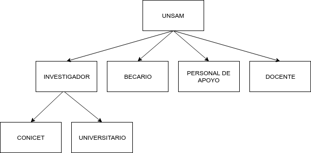
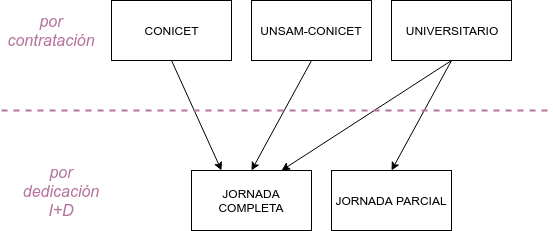

# Definiciones

## Investigadores

::: tip Clasificación
El personal es clasificado como **INVESTIGADOR** cuando satisface los criterios de mérito y es contratado para desarrollar su actividad en el ámbito de la UNSAM.
:::

### Criterios de mérito

#### _por actividad_

- Por lo menos 2 artículos con referato publicados en un quinquenio sin importar la afiliación.
- Por lo menos 1 libro con referato publicado en un quinquenio sin importar la afiliación.
- Por lo menos 1 capítulo de libro publicado en un quinquenio sin importar la afiliación.
- Por lo menos 1 trabajo en evento publicado en un quinquenio sin importar la afiliación.
- Solicitud de patentes en un quinquenio.
- Ser miembro de un proyecto I+D en el marco de la UNSAM.

#### _por condición_

- Carrera Conicet con lugar de trabajo en UNSAM.
- Carrera CIC con lugar de trabajo en UNSAM.
- Categoría I, II o III en el programa de Incentivo Docente.

### Indicadores

Los investigadores puede clasificarse de acuerdo a indicadores que respondan a diversos fines. Sin embargo existen dos indicadores que por su utilidad podrían considerarse mas significativos.

#### _por contratación_

- UNIVERSITARIO: Tiene dedicación docente exclusiva, semi-exclusiva, dos dedicaciones simples dentro de la misma Unidad Académica o es contratado como Investigador por la Unidad Académica.
- CONICET: Carrera de investigador CONICET con lugar de trabajo en UNSAM, puede tener hasta una dedicación docente simple.
- UNSAM-CONICET: Carrera de investigador CONICET con lugar de trabajo en UNSAM, tienen dedicación docente exclusiva o semiexclusiva.
- ASOCIADO: Es reconocido como investigador por la Unidad Académica en condición ad-honorem.

#### _por dedicación a I+D_

- JORNADA COMPLETA: dedica mas de 30 horas semanales a la actividad I+D.
- JORNADA PARCIAL: dedica hasta 30 horas semanales a la actividad I+D. A su vez se subdivide en dos grupos: menos de 4 horas semanales y entre 4 y 30 horas semanales.

## Becarios

::: tip Clasificación
Los becarios están clasificados según la entidad que financia su beca.
:::

<!--  -->

- BECARIOS UNSAM: perciben una beca de doctorado o posdoctorado financiada por UNSAM o alguna de sus dependencias.
- BECARIOS CONICET: perciben una beca financiada por CONICET con lugar de trabajo en UNSAM.
- BECARIOS UNSAM-CONICET: perciben una beca cofinanciada por CONICET Y UNSAM.
- BECARIOS ANPCYT: son miembros de un proyecto otorgado a UNSAM y financiado por ANPCYT. Deben ser estudiantes de posgrado de una carrera acreditada por la CONEAU, su director debe ser miembro del grupo no necesariamente con lugar de trabajo en UNSAM.

## Personal de apoyo

- TÉCNICO: es la persona cuyo trabajo requiere conocimiento y experiencia de
  naturaleza técnica en uno o en varios campos del saber. Ejecutan sus tareas bajo la
  supervisión del investigador. En general corresponde a: asistentes de laboratorio, dibujantes,
  asistentes de ingenieros, fotógrafos, técnicos mecánicos y eléctricos, programadores, etc.
  Esta categoría incluye a estudiantes universitarios no graduados que realizan actividades de
  I+D.
- ADMINISTRATIVO: : es la persona que colabora en servicios de apoyo a las actividades de
  investigación y desarrollo (I+D), tales como personal de oficina, administrativos, operarios,
  etc. Esta categoría incluye a gerentes y administradores que se ocupan de problemas
  financieros, de personal, etc., siempre que sus actividades se relacionen con CyT.
- CPA-CONICET: personal de apoyo CONICET.

## Docentes

Los docentes no realizan actividades de ciencia y tencnología en el ámbito de la UNSAM y están clasificados por su cargo de dedicación máxima.

- DOCENTE EXCLUSIVO: docente de dedicación exclusiva.
- DOCENTE SEMI-EXCLUSIVO: docente de dedicacion semi-exclusiva.
- DOCENTE SIMPLE: docente de dedicación simple.
- CONTRATADO: docente que es contratado y no tiene asociada una dedicacion.
